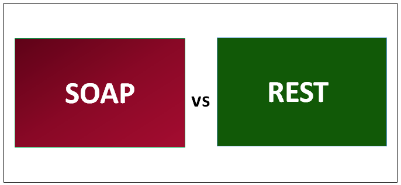
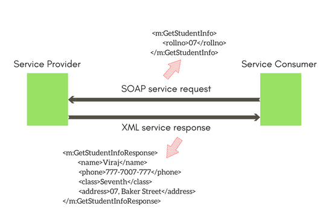

# SI Project - SOAP/REST Services

#####  REST vs. SOAP

SOAP services often suffer from the lack of flexibility in comparison to RESTful services. This leads to high maintainence and limits the overall possibilities because of its outdated protocol. Addressing these issues, is to give a clear understanding of the challenges with SOAP, and why REST is more common and flexible to use for developers. 
 

 overly verbose and hard to maintain
 ##### Notes (not part of abstract):
REST vs. SOAP: Why REST is more common & flexible to use than SOAP. This is relevant for a developer to have the knowledge for, since SOAP & REST are the most popular Web Service's Protocol in the IT-industry to integrat different systems.

cons for soap: old, not as simple as rest, soap relies only on XML, harder to develop, hard to setup, heavyweight, higher learning curve, expensive tools required, doesnt use get/post/put/delete http protocol, REST APIs are taking over, 

A WSDL file is hard to change, and if a SOAP web service needs to be extended, modified or deprecated in some small form, it’s a big change for both the internal developers and the users (who now must adapt to the new contract).

the XML used in SOAP can become complex and more difficult to program as it tends to be verbose with the XML messaging structure containing an envelope, header, body and fault elements. 
.................................

## Introduction
In the old days, SOAP services were the main protocol to web-based services. Today, SOAP is taking a toll on the modern day developer because it is still used in legacy systems. Also, it is overly verbose and hard to maintain. Nowadays developers generally prefer RESTful web services since it is more widely known, new and easy to use.

## SOAP(Simple Object Access Protocol)
SOAP is a messaging protocol for the exchange of structured information(XML) in regards of web-service development. SOAP uses XML-structure for the format of messages, relies on protocols such as HTTP and SMTP for data transmission and message exchangement. XML communation consists of several elements to achieve messaging and its major characteristics: 

- An envelope, which indicates how the message is structured and how it gets processed. 
- Encoding rules, which specifies the accessible data-types.
- Collection of methods and responses
- SOAP operates over any protocol(Such as HTTP, SMTP, TCP, etc...)
- SOAP is programmable throughout any model, so it does not rely on a specific pattern.
- Extensibility 
  references: (https://en.wikipedia.org/wiki/SOAP)

  
  
  Picture links:(https://www.studytonight.com/rest-web-service/types-of-webservices)
## REST(REpresentational State Transfer)
REST is an architectural style for developing web-services. Some knows this as the successor of SOAP-based services. This is also known as RESTful web-services. This style, allows the requesting system to manipulate textual documents(or representations) by using a set of stateless operations. 
Reference:(https://en.wikipedia.org/wiki/Representational_state_transfer)
RESTful elements consist of:

- **Client-Server:** The separation of client and server, so that the server and client can be run independently of each other. 
- **Stateless:** The server does not need to know in which state the client is, and vice versa.
- **Cache:** To improve network effiency, a cache layer is added. Since REST is stateless, cache gives the client the upportunity to reuse the response/request later on.
- **Uniform Interface**
- **Layered System**

NOTE:: Elaborate in the conclusion about how SOAP exposes all of its functionality(creating a state of the current instance), while RESTful webservices are stateless, and therefore more flexible in terms of developing these web-services

The problem lies in SOAP being overly verbose and hard to maintain. Other than problems such as these.

How does SOAP lack of flexibility in comparison to REST? 
Why is SOAP causing higher maintainence in comparison to REST? 
Why is REST more preferable than SOAP? 
we had 

#### notes:

Some of the problems we encounted during our experiment had mainly to do with SOAP. We had no freedom of choice when it came to the response (only XML) as we did with REST (JSON,XML etc.). Also we spent more time doing the SOAP part, because the lines of code was more than in REST. 

## Evidence, evidence, evidence

<h5>The following screenshots contain relevant evidence and explanations from our mini assignment in system integration</h5>

(for more details on the project, click <a href="https://github.com/Mokayed/Mini-Project-Web-Services"> here</a>)

<figure>
<h4>1. Requests in SOAP vs REST</h4>
  
  <figcaption><li>deposit request in REST using postman</li></figcaption>
  
  <figcaption><li>deposit request in SOAP using SoapUI</li></figcaption>
  <h6>During development we had a much easier time dealing with REST requests, not only because of us having more knowledge on it, but also because we spent more time in average on building the envelope request whereas the REST request could be made in seconds.</h6>
  <h4>2. Response in SOAP vs REST</h4>
  
<figcaption><li>the response in REST</li></figcaption>

<figcaption><li>the response in SOAP</li></figcaption>
  <h6>As seen, the response from SOAP is in XML format, and this is something that cannot be changed in SOAP. In REST, the data format was our own choice. As seen we went for JSON. As a result of it being JSON the resposne became much smaller than the envelope response</h6>

<h4>3. The SOAP WSDL File</h4>
<h6>in SOAP, there is only one place to go for requesting endpoints, and that is the WSDL url. Our file ended up having 193 lines of xml code and can be seen by clicking <a href="./customerDetailsWsdl.wsdl.xml"> here</a>. Although we liked the idea of having requests/responses very well structured in WSDL, we could not help feeling annoyed by it being XML, and very verbose. In REST there is no WSDL file where it relies upon the HTTP standard.</h6>

<h4>4. Endpoints</h4>

<figcaption><li>endpoint for showing customer name and it's details in REST + shown on browser</li></figcaption>

<figcaption><li>endpoint for deposit request in SOAP, which can only be referred to from the WSDL url</li></figcaption>
<h6>As seen, the REST implementation of the endpoints are very simple, however in SOAP you need to make both a request and response endpoint which ends up being alot of code.<h6>
<h4>5. Total lines of code</h4>

tool used for results: bash (<a href="https://stackoverflow.com/questions/3435581/how-to-count-lines-of-java-code-using-intellij-idea">reference</a>)

<figcaption>lines of code in our REST project</figcaption>

<figcaption>lines of code in our SOAP project</figcaption>

<h6>the resulsts shows and proofs, that the SOAP project is much more verbose than the REST project.</h6>
</figure>

murched: make research to find some ecidence from the internet (related articles that proofs things that our own project does not)

hazem: Definition af SOAP, definition af REST. Find artikler omkring SOAP disadvantages.
reference to difference between SOAP and REST:(https://smartbear.com/blog/test-and-monitor/understanding-soap-and-rest-basics/) 

## Conclusion 
## Consequences

https://github.com/Mokayed/Mini-Project-Web-Services

### BRAINSTORM: 
Problem definition: 
SOAP vs REST: our experiences with both(SOAP, high maintainence, complex protocol, outdated data transfer models(I.e SOAP envelopes), REST is the successor of SOAP)

here we attach some evidence from our project that has to do with proving the easier implmenatation of rest versus soap. First evidence has to do with lines of code comparably, and second the structure of the response of the data.