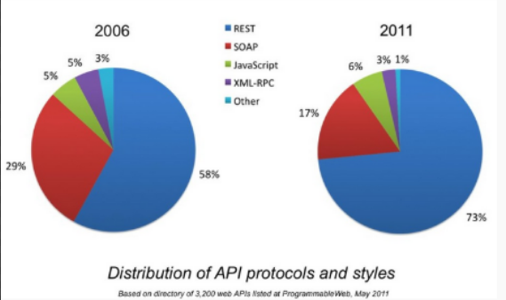

<h1 align="center"> REST is taking over SOAP </h1>

by: Hallur við Neyst, Murshed Kayed, Hazem Saeid</b>

SOAP services often suffer from the lack of flexibility in comparison to RESTful services. This leads to high maintainence and limits the overall possibilities because of its outdated protocol. Addressing these issues, is to give a clear understanding of the challenges with SOAP, and why REST is more common and flexible to use for developers, and SOAP is overly verbose and hard to maintain. 

 
 <h1>  REST 🆚 SOAP </h1>
 
<h3> Introduction <g-emoji class="g-emoji" alias="page_facing_up" fallback-src="https://github.githubassets.com/images/icons/emoji/unicode/1f4c4.png">📄</g-emoji> </h3>

In the old days, SOAP services were the main protocol to web-based services. Today, SOAP is taking a toll on the modern day developer because it is still being used in legacy systems, and some developers choose SOAP since it supports  WS-Security which can come in handy. Also, it is overly verbose and hard to maintain. Nowadays developers generally prefer RESTful web services since it is more widely known, new and easy to use.

<h3>What is REST & SOAP <g-emoji class="g-emoji" alias="interrobang" fallback-src="https://github.githubassets.com/images/icons/emoji/unicode/2049.png">⁉️</g-emoji></h3>

In this section we will dig deeper into the definition of the respective services in terms of definition and the characteristics of REST and SOAP.
<h4> SOAP(Simple Object Access Protocol) 1  </h4>

<figure>

<figcaption>SOAP Envelope Illustration:<a>  https://www.studytonight.com/rest-web-service/types-of-webservices</a></figcaption>

</figure>

  

SOAP is a messaging protocol for the exchange of structured information(XML) in regards of web-service development. SOAP uses XML-structure for the format of messages, relies on protocols such as HTTP and SMTP for data transmission and message exchangement. XML communication consists of several elements to achieve messaging and its major characteristics: 

- An envelope, which indicates how the message is structured and how it gets processed. 
- Encoding rules, which specifies the accessible data-types.
- Collection of methods and responses
- SOAP operates over any protocol(Such as HTTP, SMTP, TCP, etc...)
- SOAP is programmable throughout any model, so it does not rely on a specific pattern.
- Extensibility

 
 
 
 
 

  
  
<h4> REST(Representational State Transfer) 2 </h4>

REST is an architectural style for developing web-services. It is also known as being the successor of SOAP-based services. This is also known as RESTful web-services. This style, allows the requesting system to manipulate textual documents(or representations) by using a set of stateless operations. 
RESTful elements consist of:

- **Client-Server:** The separation of client and server, so that the server and client can be run independently of each other. 
- **Stateless:** The server does not need to know in which state the client is, and vice versa.
- **Cache:** To improve network effiency, a cache layer is added. Since REST is stateless, cache gives the client the opportunity to reuse the response/request later on.
- **Uniform Interface**
- **Layered System**

REST webservice: <a href="https://medium.com/@sagar.mane006/understanding-rest-representational-state-transfer-85256b9424aa">https://medium.com/@sagar.mane006/understanding-rest-representational-state-transfer-85256b9424aa</a>

Some of the problems we encounted during our experiment had mainly to do with SOAP. We had no freedom of choice when it came to the response (only XML) as we did with REST (JSON,XML etc.). Also we spent more time doing the SOAP part, because the lines of code was more than in REST. 

<h1>Evidence from our project3 <g-emoji class="g-emoji" alias="mag" fallback-src="https://github.githubassets.com/images/icons/emoji/unicode/1f50d.png">🔍</g-emoji></h1>

The following screenshots contain relevant evidence and explanations from our mini assignment in system integration. In the following points, we will discuss the diffirence between SOAP/REST requests and responses according to our experience from our project. We will also explain the WSDL file in the project, then we will show our endpoints. Finally we will conclude by counting the amount of lines comparably between the SOAP and REST project.

<figure>
<h4>1. Requests in SOAP vs REST</h4>

  
  <figcaption><li>Deposit request in REST using postman</li></figcaption>
  

  
  <figcaption><li>Deposit request in SOAP using SoapUI</li></figcaption>

   
  
  
During development we had an easier time dealing with REST requests. Sure we already had tried working with it before, but after working with SOAP our opinions on it did not change much. This was mainly because of the request in SOAP being needed to be made in XML in a form called "envelope", whereas the same style of request in REST could be made in a matter of seconds.

  <h4>2. Response in SOAP vs REST</h4>

  
<figcaption><li>The response in REST</li></figcaption>

<figcaption><li>The response in SOAP</li></figcaption>

  
As seen, the response from SOAP is made in XML format, and this is something that cannot be changed in SOAP. In REST there is more data-format opportunities to choose. As seen we went for JSON. As a result of it being JSON the resposne became much smaller than the envelope response

<h4>3. The SOAP WSDL File4</h4>

SOAP endpoints are connected to the url of the WSDL file. Our file ended up having 193 XML lines. Although we liked the idea of having requests/responses well structured as they are in WSDL, we felt forced because of the required XML data type, and as a result the file became verbose. In REST there is no WSDL file because of it being relied upon HTTP standard.

<h4>4. Endpoints5,6</h4>

<figcaption><li>Endpoint for showing customer name and further details in REST. Also the endpoint is accesible through a browser</li></figcaption>

<figcaption><li>Endpoint for deposit request in SOAP, which can only be referred to from the WSDL path</li></figcaption>

As seen, the REST implementation of the endpoints are simple, however in SOAP you need to make both a request and response endpoint which ends up being alot of code.

<h4>5. Total lines of code</h4>

tool used for couting lines of code in SOAP/REST is bash

<figcaption><li>lines of code in our REST project is 302</li></figcaption>

<figcaption><li>lines of code in our SOAP project is 1339</li></figcaption>

  

The result show and proof, that the SOAP project is more verbose than the REST project.

</figure>

<h1>Evidence on usability in SOAP vs REST in the industry <g-emoji class="g-emoji" alias="chart_with_downwards_trend" fallback-src="https://github.githubassets.com/images/icons/emoji/unicode/1f4c9.png">📉</g-emoji></h1>

evolvment in SOAP/REST from 2005 until 2011<a>https://www.infoq.com/news/2011/06/Is-REST-Successful/</a>  

REST is successful since it is the most used service in the industy. Already in 2011, 73% of the APis on Programmable Web used REST. SOAP is far behind but is still represented in 17% of the APIs. The reasoins that makes rest is more in use that it is much easier to implement since it requires less bandwidth and resources, and the uses standard HTTP in rest is much simpler. 

"REST supports diffrent data types one of the types is JSON, which allows better support for browser clients. One of the main reseans that REST is successful, that REST have better performance and scalability since it's reads can be cached, SOAP based reads cannot be cached. REST supports stateless CRUD operations, which gives the developer a better overview on the data. to read more by clicking <a href="https://medium.com/@LazaroIbanez/soap-vs-rest-68faf2ea970e
"> here</a>." 

There is nothing useful in SOAP that can't be done with REST for transport, and JSON, XML, or even plain text for data representation, to read more take a look on that<a href="https://stackoverflow.com/questions/76595/soap-or-rest-for-web-services"> link</a>. 

REST allows a better variety of data formats, whereas SOAP only allows XML. REST is generally considered easier to work with. Thanks to JSON which typically works better with data and offers faster parsing, REST offers better support for browser clients, you can read more by <a href="https://stackify.com/soap-vs-rest/"> clicking here</a>.

However, SOAP still have advantages7, it supports WS-security which adds some security features, SOAP uses WSDL makes your requests and responses very well structured.  SOAP works well in distributed enterprise environments where REST assumes direct point-to-point communication. The major advantage of SOAP is that it is a light-weight protocol since it is XML based, since xml is a lightweight data interchange language.

 
 

<h1>Conclusion <g-emoji class="g-emoji" alias="memo" fallback-src="https://github.githubassets.com/images/icons/emoji/unicode/1f4dd.png">📝</g-emoji></h1>

After comparing REST and SOAP in various areas in our project, we see a pattern in where REST is being adopted as the new industry standard, also being referenced as the successor of SOAP. The comparisons that made us most sure had to do with popularity, flexibilty, verbosity and maintenance. In the experiments that we conducted showed a significant diffirence in creating SOAP services and required a great amount of work in comparison to constructing RESTful webservices. However, SOAP still contains some positive elements, one of them being WS-Security and a well structured request/response architecture. One of the major challenges that SOAP suffers is the flexibility regarding messaging formats, where SOAP only can use XML and REST has various diffirent messaging formats(such as JSON,XML, PLAN TEXT etc.). As a result the rise of RESTful web services are justifies, by being more suitable and compliant to the developers and to the ever-changing industries.

## References
<ol>
  <li>Simple Access Object Protocol (SOAP) <a href="https://en.wikipedia.org/wiki/SOAP">https://en.wikipedia.org/wiki/SOAP</a></li>
  <li>Representational State Transfer (REST) <a href="https://en.wikipedia.org/wiki/Representational_state_transfer">https://en.wikipedia.org/wiki/Representational_state_transfer</a></li>
  <li>Mini Project Assignment 1 System Integration <a href="https://github.com/Mokayed/Mini-Project-Web-Services">https://github.com/Mokayed/Mini-Project-Web-Services</a></li>
  <li>WSDL file in our SOAP project <a href="customerDetailsWsdl.wsdl.xml">./customerDetailsWsdl.wsdl.xml</a></li>
  <li>Controller containing endpoints in our REST project <a href="https://github.com/Mokayed/Mini-Project-Web-Services/blob/master/ResttfulService/src/main/java/dk/dd/demo/controller/CustomerController.java">https://github.com/Mokayed/Mini-Project-Web-Services/blob/master/ResttfulService/src/main/java/dk/dd/demo/controller/CustomerController.java</a></li>
  <li>Request and Response endpoints in our SOAP project <a href="https://github.com/Mokayed/Mini-Project-Web-Services/blob/master/banking-service/src/main/java/com/soap/bank/bankingservice/CustomerEndpoint.java">https://github.com/Mokayed/Mini-Project-Web-Services/blob/master/banking-service/src/main/java/com/soap/bank/bankingservice/CustomerEndpoint.java</a></li>
  <li>Understanding SOAP and REST basics <a href="https://smartbear.com/blog/test-and-monitor/understanding-soap-and-rest-basics/">https://smartbear.com/blog/test-and-monitor/understanding-soap-and-rest-basics/</a></li>
</ol> 
